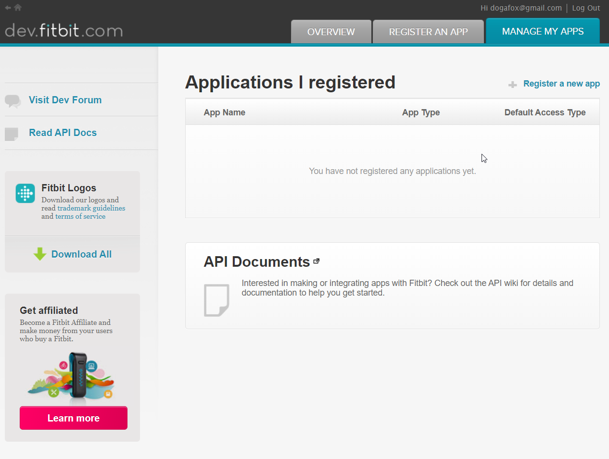
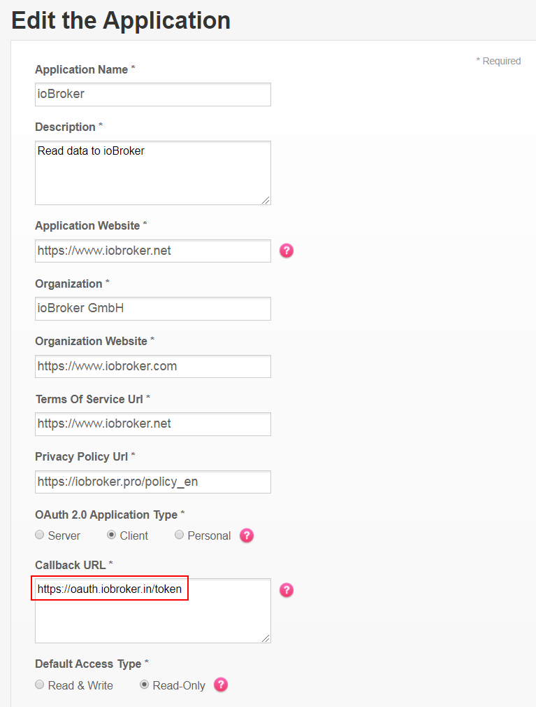
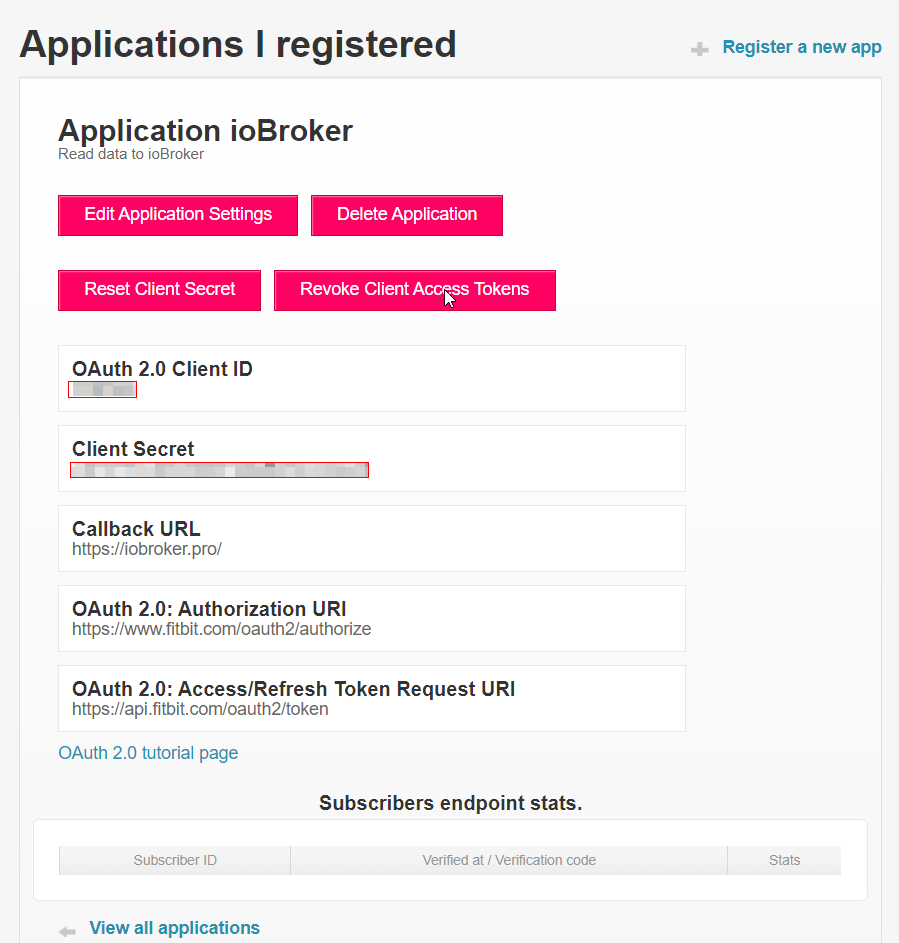
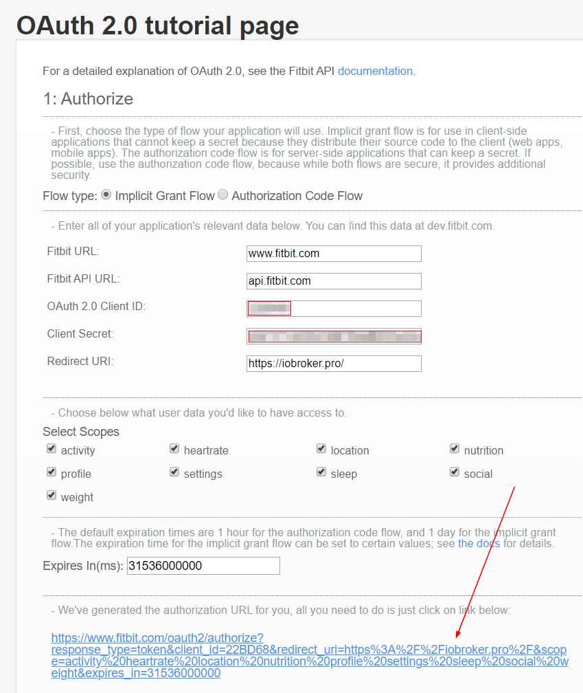

# ioBroker.fitbit

This adapter pulls Data from fitbit API!

## Configuration

Register your APP on https://dev.fitbit.com/apps

`Callback URL` **is important!**: `https://oauth.iobroker.in/token`
You can use following settings:
- `Application Website`: `https://www.iobroker.net`
- `Organization`: `ioBroker Community`
- `Organization Website`: `https://www.iobroker.com`
- `Terms Of Service Url`: `https://iobroker.pro/policy_en`
- `Privacy Policy Url`: `https://iobroker.pro/policy_en`
- `OAuth 2.0 Application Type`: `client`
- **Callback URL***: `https://oauth.iobroker.in/token`

And press `Save` at the bottom of the input form.

Copy the `Client ID` and `Client secret`.

Insert `clientID` and `client secret` into adapter configuration.

Press "Authorize" button.

After that you could be asked to enter your credentials again or if the browser cache is still consist the cookies, it could be done automatically.

Then `access token` and `refresh token` will appear. They are read-only.

Don't forget to save the configuration settings, else the refresh of the token will not work.

If the process does not work for you, you can try to get the access token manually: https://dev.fitbit.com/apps/oauthinteractivetutorial

## Development
The API was implemented according to https://dev.fitbit.com/build/reference/web-api/basics/

## Changelog

### 0.1.0
* (bluefox) initial release

## License
The MIT License (MIT)

Copyright 2019, bluefox <dogafox@gmail.com>

Permission is hereby granted, free of charge, to any person obtaining a copy
of this software and associated documentation files (the "Software"), to deal
in the Software without restriction, including without limitation the rights
to use, copy, modify, merge, publish, distribute, sublicense, and/or sell
copies of the Software, and to permit persons to whom the Software is
furnished to do so, subject to the following conditions:

The above copyright notice and this permission notice shall be included in
all copies or substantial portions of the Software.

THE SOFTWARE IS PROVIDED "AS IS", WITHOUT WARRANTY OF ANY KIND, EXPRESS OR
IMPLIED, INCLUDING BUT NOT LIMITED TO THE WARRANTIES OF MERCHANTABILITY,
FITNESS FOR A PARTICULAR PURPOSE AND NONINFRINGEMENT. IN NO EVENT SHALL THE
AUTHORS OR COPYRIGHT HOLDERS BE LIABLE FOR ANY CLAIM, DAMAGES OR OTHER
LIABILITY, WHETHER IN AN ACTION OF CONTRACT, TORT OR OTHERWISE, ARISING FROM,
OUT OF OR IN CONNECTION WITH THE SOFTWARE OR THE USE OR OTHER DEALINGS IN
THE SOFTWARE.
